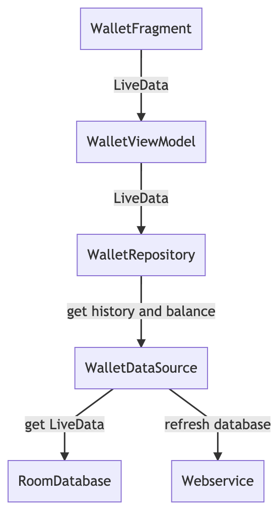
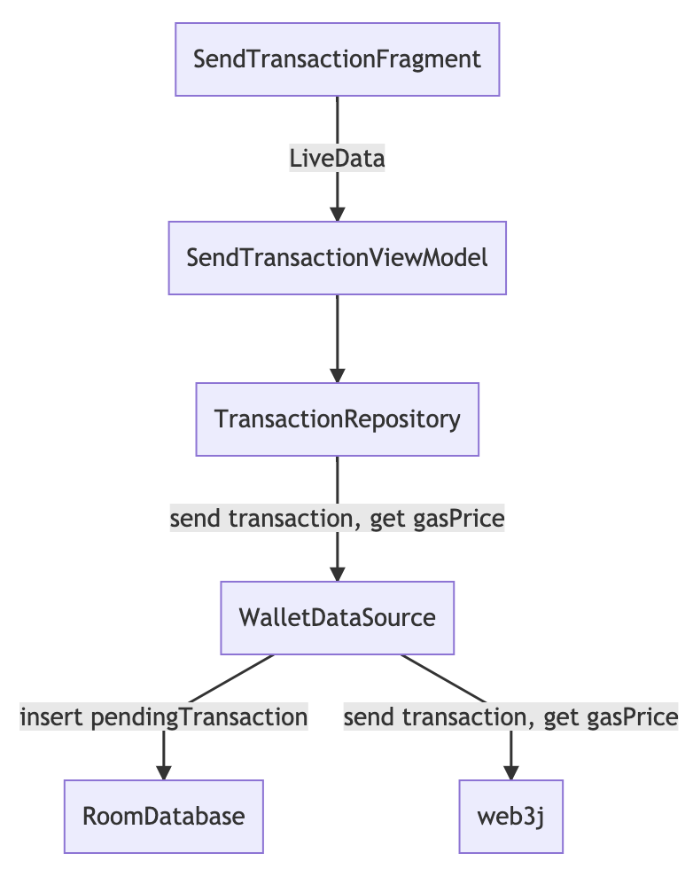

# TokenBox





```
graph TD
WalletFragment -->|LiveData|WalletViewModel 
WalletViewModel --> |LiveData| WalletRepository
WalletRepository --> |get history and balance|WalletDataSource
WalletDataSource --> |get LiveData|RoomDatabase
WalletDataSource --> |refresh database|Webservice
```

```
graph TD
SendTransactionFragment -->|LiveData|SendTransactionViewModel 
SendTransactionViewModel --> TransactionRepository
TransactionRepository --> |send transaction, get gasPrice| TransactionDataSource
TransactionDataSource --> |insert pendingTransaction|RoomDatabase
TransactionDataSource --> |send transaction, get gasPrice|web3j
```

```
graph TD

ImportWalletFragment -->ImportWalletViewModel 
ImportWalletViewModel --> WalletRepository
WalletRepository --> |create and save wallet| WalletDataSource
WalletDataSource --> |save wallet|Preference
```

