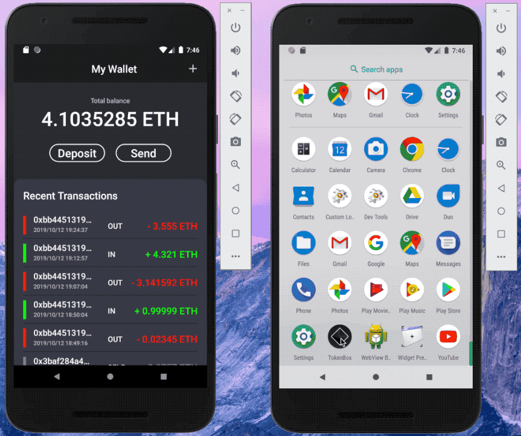
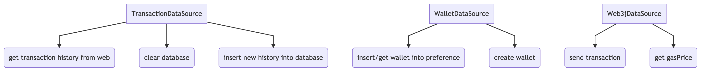
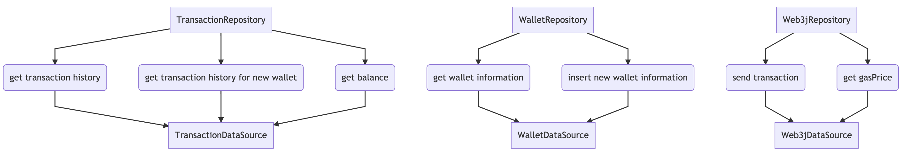
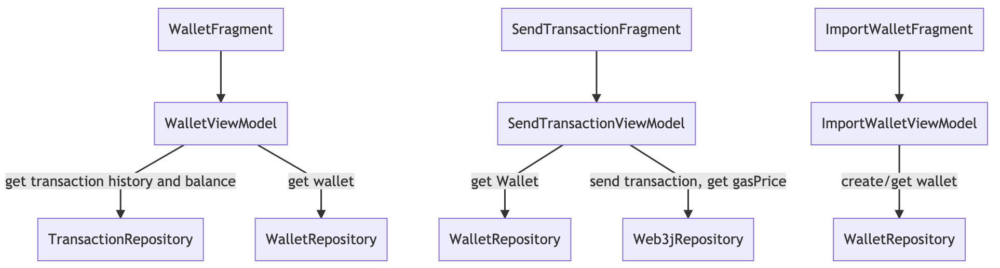

# TokenBox - Basic blockchain wallet(Ropsten Testnet ETH)



- User can use the mnemonic phrase or the corresponding QR code to generate their wallet.
- User can check the real time balance.
- User can check real time transaction history.
- User can send ETH to others by scanning the QR code of other user's address.
- User can give the QR code of their wallet address to let other user to scan.
- User can see the real time state of their account.

## Architecture





```
graph TD
TransactionDataSource --> A(get transaction history from web)
TransactionDataSource --> B(clear database)
TransactionDataSource --> C(insert new history into database)

WalletDataSource --> D(insert/get wallet into preference)
WalletDataSource --> E(create wallet)

Web3jDataSource --> F(send transaction)
Web3jDataSource --> G(get gasPrice)
```

```
graph TD
TransactionRepository --> A(get transaction history) --> TransactionDataSource
TransactionRepository --> B(get transaction history for new wallet) --> TransactionDataSource
TransactionRepository --> C(get balance) --> TransactionDataSource

WalletRepository --> D(get wallet information) --> WalletDataSource
WalletRepository --> E(insert new wallet information) --> WalletDataSource

Web3jRepository --> F(send transaction) --> Web3jDataSource
Web3jRepository --> G(get gasPrice) --> Web3jDataSource
```

```
graph TD
graph TD
WalletFragment -->WalletViewModel 
WalletViewModel --> |get transaction history and balance|TransactionRepository
WalletViewModel --> |get wallet|WalletRepository

SendTransactionFragment --> A[SendTransactionViewModel]
A --> |get Wallet|B[WalletRepository]
A --> |send transaction, get gasPrice|Web3jRepository

ImportWalletFragment -->ImportWalletViewModel 
ImportWalletViewModel --> |create/get wallet|C[WalletRepository]
```

